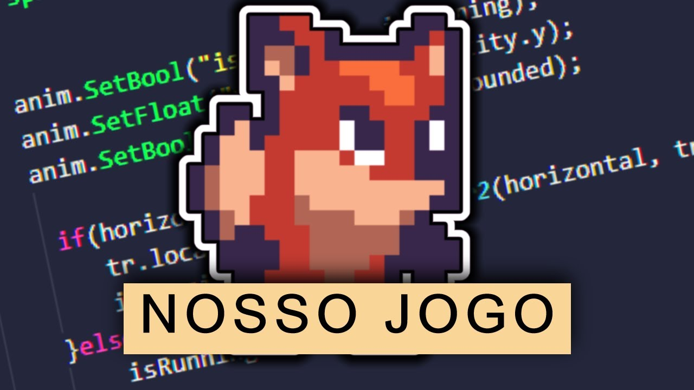

# Fox With Gun

## Summary

- [Description](#description)
- [Communities](#communities)
- [Philosophy](#philosophy)
- [Rules](#rules)

## Description

Fox With Gun is a 2D platformer game about a fox with gun, developed by the community. Anyone can contribute to the project, either by creating new levels, adding new features, creating the art, the music, the sound effects, the history, the translations, etc.

    

A open source game made with [Godot Engine](https://godotengine.org/).

## Communities

- [Youtube](https://www.youtube.com/@nossojogodaraposa6679/)
- [Gamejolt](https://gamejolt.com/games/NossoJogo/624843)
- [Reddit](https://www.reddit.com/r/FoxWithGun/)

## Philosophy

At its core, the "Fox With Gun" project is driven by the philosophy of collaboration, openness, and creativity. The project welcomes contributions from anyone, regardless of their background, experience, or skills. Whether you are an artist, a programmer, a musician, a writer, or just a fan of games, you are encouraged to join and share your ideas, feedback, and creations.

One of the key principles of the project is that it is completely free and open source. This means that all the code, assets, and documentation are available for anyone to use, modify, and distribute, without any restrictions or limitations. By embracing the principles of open source, the "Fox With Gun" project aims to foster a culture of collaboration, innovation, and learning, where everyone can learn from each other and build upon each other's ideas.

Another important aspect of the project is its focus on community building and engagement. The project is not just about creating a game, but also about creating a community of people who share a passion for games, creativity, and collaboration. Through various channels such as Discord, GitHub, and social media, the project aims to provide a space where people can connect, share, and learn from each other, and where everyone's contributions are valued and appreciated.

In summary, the "Fox With Gun" project is not just a game, but also a community-driven, open-source, and inclusive project that aims to promote collaboration, creativity, and diversity. By joining the project, you become part of a community of passionate and talented people who share a common vision and a common goal: to create a fun, engaging, and memorable game that everyone can enjoy.

## Rules

- By contributing to the project, you agree that your contributions are of your own free will and in line with the project's ideals of being free, open source, and open for anyone to use as they see fit. If you wish to remove your contributions, please contact the maintainers. Otherwise, you cannot claim copyright over any of the contributions you have made.

- Only use assets with licenses that allow for free and open use, such as CC0, CC-BY, or MIT.

- Do not use any copyrighted material without permission from the owner or a license that allows for its use.

- Do not steal or plagiarize code from other projects or contributors. All code should be original or properly attributed.

- Do not upload any content that is inappropriate or offensive, including but not limited to, content that is discriminatory, harassing, or contains explicit language or sexual content.

- Respect the intellectual property rights of others. Do not upload or distribute any content that infringes on the intellectual property rights of others, including but not limited to, patents, trademarks, and copyrights.

- Keep discussions and comments respectful and constructive. Do not engage in personal attacks, bullying, or harassment of other contributors.

- Do not use the project or platform for any illegal activity or to promote illegal activity.

- Follow the guidelines and instructions provided by the project maintainers, including code conventions, commit guidelines, and issue reporting procedures.

- Be respectful of other contributors' time and efforts. Do not submit irrelevant or spammy contributions, or create unnecessary issues or pull requests.

- Report any violations of the community rules to the project maintainers or moderators.

- The project maintainers and moderators reserve the right to remove, edit, or reject any contributions that do not comply with the community rules.

- The project maintainers and moderators reserve the right to ban any contributor who repeatedly violates the community rules.

- The project maintainers and moderators reserve the right to change the community rules at any time.
